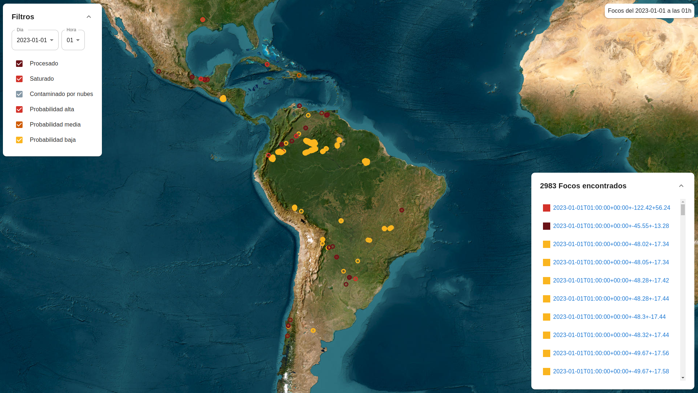

<!-- PROJECT LOGO -->
<br />
<div align="center">
  <a href="https://github.com/facundoPri/wildfire-viewer">
  </a>

<h3 align="center">WildFire Visualizer</h3>

  <p align="center">
    A Wildfire Visualizer challenge
  </p>
</div>

<!-- ABOUT THE PROJECT -->
## About The Project



A React-based wildfire visualizer that utilizes React-Leaflet to display wildfires on an interactive map. Users can filter data to explore wildfires by various criteria. Powered by Redux Toolkit for robust state management, and leveraging MSW to mock a JSON API, this visualizer provides a dynamic and informative experience.


### Built With

* [React](https://es.react.dev/)
* [Redux Toolkit](https://redux-toolkit.js.org/)
* [React-leaflet](https://react-leaflet.js.org/)
* [MUI](https://mui.com/)
* [Mock Service Worker](https://mswjs.io/)


<!-- GETTING STARTED -->
## Getting Started

Setting up your project locally.
To get a local copy up and running follow these simple example steps.

### Prerequisites

* nodejs
* npm

### Installation

1. Clone the repo

   ```sh
   git clone https://github.com/github_username/repo_name.git
   cd wildfire-viewer
   ```

2. Copy the .env.example as .env

   ```sh
   cp .env.example .env
   ```

3. Install NPM packages

   ```sh
   npm install
   ```

4. Run

   ```js
   npm run start
   ```


<!-- CONTACT -->
## Contact

Facundo Prieto - [facundo-prieto](https://www.linkedin.com/in/facundo-prieto/) - <facundo.prieto@gmail.com>

Project Link: [https://github.com/facundoPri/wildfire-viewer](https://github.com/facundoPri/wildfire-viewer)

